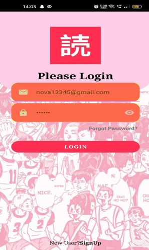

# 📚 Manga Book Organizer App  

An Android app to **manage, categorize, and read manga books** with ease.  
Built using **Android Studio** and **Firebase**, it allows **admins** to upload manga PDFs, create categories, and **users** to browse and read collections seamlessly.  

---

## 🚀 Features  

- 🔐 Secure **Login for Admin & Users**  
- 👨‍💻 **Admin Dashboard** – Add, edit, and delete manga categories  
- 📂 Upload manga **PDFs with metadata** (title, description, category)  
- 📖 In-app **PDF Reader** for a smooth reading experience  
- 🔎 **Search & filter** by title or category  
- 🎨 Clean **Material UI design**  

---

## 📸 Screenshots  

| Splash Screen | First Screen | Login Screen | Admin Dashboard | Book List |  
|---------------|--------------|--------------|-----------------|-----------|
|  |  |  |  |  |


---

## 🛠️ Tech Stack  

- **Language:** Java (Android)  
- **IDE:** Android Studio  
- **Database & Authentication:** Firebase Realtime Database & Firebase Auth  
- **Storage:** Firebase Cloud Storage (for PDFs)  
- **UI Components:** RecyclerView, CardView, FloatingActionButton, PDFView  

---

## ⚙️ Installation  

1. **Clone the repository**  
   ```bash
   git clone https://github.com/your-username/MangaBookOrganizerApp.git
   cd MangaBookOrganizerApp
Open in Android Studio

Set up Firebase

Create a Firebase project

Enable Authentication (Email/Password)

Enable Realtime Database and Cloud Storage

Download google-services.json and place it inside the app/ folder

Build & Run 🚀

👨‍💻 Author
Jeevan Ramesh Jadhav
🎓 M.Sc. Blockchain Technology, MIT World Peace University

📧 jeevanj020604@gmail.com
🔗 LinkedIn:

📜 License
This project is licensed under the MIT License – free to use and modify.

📄 Detailed Documentation:
See docs/Document.pdf for a complete project report, code structure, and setup details.

yaml
Copy code
